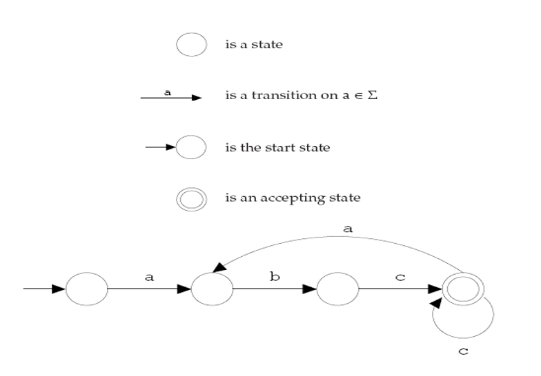
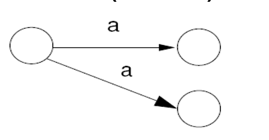
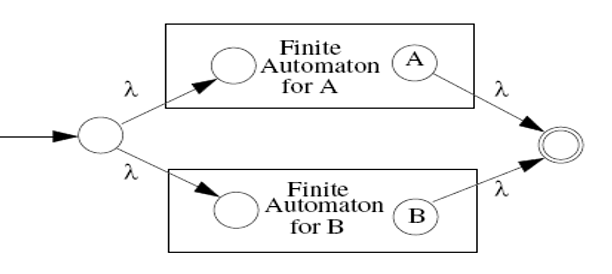
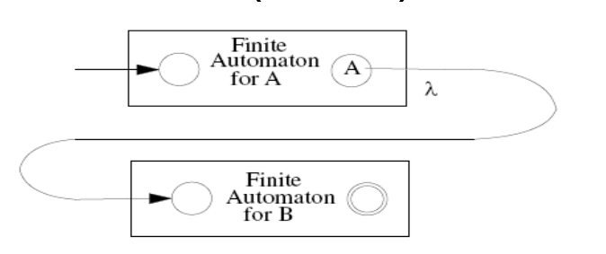
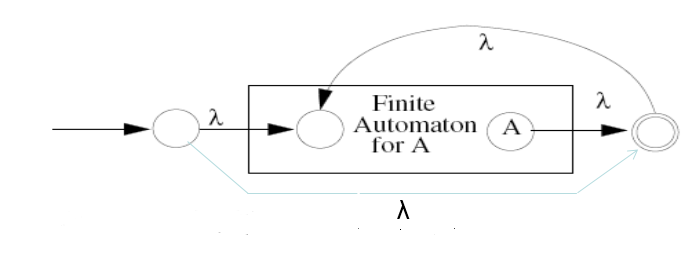
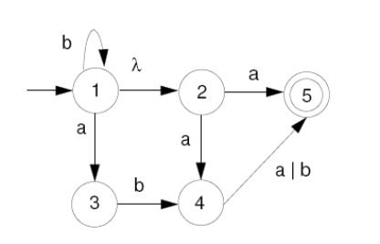
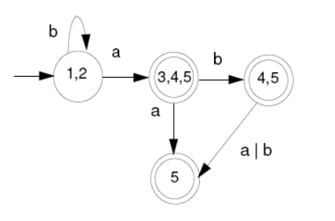

<link href="./style.css" rel="stylesheet" />

# Compiler
---
## What is Compiler
* compiler is a program that accepts programming language , 
then output assembly language which will be assembled into machine language
* OS dependent 
* this process is compilation
## Front-end & Back-end
* font-end 分析 source code 並轉成intermediate representation ( IR ) 
，platform-independent盡量與平台無關。
* back-end tranform IR to target code( assembly code ) 
，machine dependent
## Pure machine code 
* 與OS平台無關的機器語言 
platform-independent 
## Augmented machine code
* 會受到不同平台影響的機器語言(system call , window APIs) 
platform-dependent
## Virtual machine code
* generate virtual machine instructions
* run with VM interpreter 
( interpreter is OS dependent )
* benifit : portability
## Bootstrapping
* 將A compiler 的code generation改成B assembly code  
然後將A 的source code 餵給自己
## Compiler vs. Interpreter
* compiler
全部翻譯完才執行
* interpreter
直譯器，翻譯一行，執行一行
## Scanner
* scanner會分析輸入的字串charecter stream，並分類轉成token string
* also called <strong>lexical analyzer</strong>
> ### Token
> * terminal symbol (cannot be rewritten)
> * struct token { type , value , name }
> ### Regular expression
> * 是被用來匹配字串中字元組合的規則
> * 根據input的character stream 轉換成對應的terminal symbol(token)
> * a set of string s defined by a regular expression is called a regular set 
>> #### Rules
>> * ' | ' or  , Alternation , meta-character
>> * ' AB ' , Catenation
>> * ' * ' many (>=0) , Kleene closure , meta-character
>> * ' + ' many (>=1) , meta-character
>> * ' ? ' optional (0 or 1)
>> * [ a-z A-Z ] (a ~ z , A ~ Z)
>> * '\d' (0 ~ 9)
>> * '^' (no character in front)
>> * '.' (any character)
>> * [ ^"a\n ] , not , (all character except " and a and \n)
> ### Finite Automata
> * FA can be uesd to recognize the tokens specified by a regular expression
> * transducer
> * FA consists of :
>> 1. A finite set of states
>> 2. A finite vocabulary 
>> 3. A set of transitions from one state to another
>> 4. A special state called the start state 
>> 5. A subset of the states called the accepting or final state 
> * Deterministic(確定性的) Finite Automata ( DFA )
>> * only one transition from a state that have the same label 
 
>> * represented with transition table ( good )
>> * represented with explicit control ( noob )
>> * Nondeterministic(不確定性的) finite automaton ( NFA )
>> * multiple transitions from a state that have the same label 
 
>> * have transitions labeled with λ 
> ### Regular expression is equivalent to FA
> * 雙向的，可以互轉
>> #### RE to NFA : 
>> 1. A|B  

>> 2. AB  

>> 3. A*  

>> #### NFA to DFA :
>> * subset construction algorithm  
  

> ### IMPORTANT NOTES
>> #### DFA/NFA are not capable of remembering the occurrences of symbols
>> * A~n~B~n~ only can represented by CFM
>> #### Context-free grammer is more powerful than regular expression
>> * RE -> FA ( low level )
>> * CFM -> Pushdown Automata ( high level )
## Parser
* parser 會分析語法是否符合定義
* 分析完成後會建成abstract syntax tree(AST)
* a set of productions( rewriting rules )
> ### Context-free grammer
> * 不會被前後文影響的改寫規則
> * ex : Recursive descent (LL type parser)
> ### Context-sensitive grammer
> * 會被前後文影響的改寫規則
> ### Two Grammer symbols
>> #### terminal(token) : cannot be rewritten
>> #### non-terminal : can be rewritten
> ### Special symbol
>> #### Prog (start-symbol , non-terminal)
>> #### λ (empty or null string)
>> #### $ (end of input stream)
>> #### ts.peek (lookahead)
> ### Abstract Syntax Tree
> * 用來表示一個program經過語法分析的中間產物
> * also create symbol table that record all ID and their type in AST

## Type checker
* type checker會檢查(AST code)語意(semantics)是否有錯誤
* ex : 未宣告就用、浮點數丟給字串...s
## Translator
* translate AST code to IR code
## Optimizer
* improve IR code's performance
## Code generator
* mapping IR code or AST into target code ( assembly code )

