<link href="./style.css" rel="stylesheet" />

# Chapter 1 : Introduction

## Page 1-2 Roadmap
---
### Protocol : 
* 通訊協定
### Edge : 
* 網路的邊邊 :  PC , Phone, Sever
### Core : 
Router
### Access net , Phyical media : 
* 如何接到網路 => 有線、無線
* 連線的材料 => 銅、光纖、電磁波
### ISP structure : 
* ISP(網際網路服務供應商)
* 網路是由階層式的方式連接，介紹連接的方法
### Preformance :
* 網路封包loss、delay，如何控制loss & delay
### Protocol layers , service models :
* protolcol , service 模組化

## Page 1-4 What’s the Internet: "nuts and bolts" view
---
### Millions of connected computing devices :
* hosts = end-systems (PC, phone , sever)
* running network apps
### Communication links : 
* fiber, copper, radio, satellite
* transmission rate = <strong>bandwidth (頻寬)
### Routers : 
* 路由器，判斷封包傳送路徑
### Protocols :
* 網路通訊協定 : TCP , IP , HTTP , FTP , PPP
### Internet = "network of networks" : 
* loosely hierarchical 階層式 
* NAT : a area have a public IP that connect to multiple private IP in this area
### Internet standards : 
* RFC , IETF : 制定標準協會

## Page 1-6 What’s the Internet: a "service" view
---
### Communication Infrastructure
* 分散式設備應用 : Web, email, games, e-commerce, database., voting, file (MP3) sharing  
* 服務 : 
>1. connectionless : 無須建連線 (UTP) => don't care loss , delay  
>2. connection=oriented : 要先建連線 (TCP) => 減少loss , delay

## Page 1-7 What’s a protocol?
---
### Network protocols :
* Define : <strong>format , order , response actions</strong>(遵循一定格式、順序、回應方法)
* Example : 
>* PC -> TCP connection(req) -> Server
>* PC <- TCP connection(res) <- Server
>* PC -> Get 'http://www.abc.com/pic.PNG'(req) -> Server
>* PC <- File(res) <- Server

## Page 1-10 Network edge
---
### End systems (hosts):
* run application : web , email (at edge of network)
### Client/Sever modol :
* client host requests and receives response from alway-on sever
### Peer-2-Peer moudole :
* client to client (no sever)

## Page 1-12 Connection-oriented service
---
### Goal : data transfer between end systems
#### TCP service (Transmission Control Protocol)
1. handshaking(建連線) : call and setup (prepare for) data transfer ahead of time
2. reliable , in ordered<b> byte stream </b> data transfer
* loss: acknowledgements and retransmissions(確認收到不然重新傳送)
3. flow control (流量控制)
* sender won’t overwhelm receiver
4. congestion control (網路擁擠控制)
* senders “slow down sending rate” when network congested(掉封包時)

## Page 1-13 Connectionless service
---
### Goal : data transfer between end systems
#### UDP (User Datagram Protocol) connectionless service
1. transfer with <b>packets</b>
2. unreliable data transfer (可能掉封包)
3. no flow control (沒有流量控制)
4. no congestion control (沒有網路擁擠控制)

## Page 1-12 & 1-13 Summary
---
### App using TCP (send important file): 
HTTP(web) , FTP(file transfer) , Telnet(remote login) , SMTP(email)
### App using UDP (don't care loss): 
Streaming media(music, video) , DNS , telephony(skype)

## Page 1-15 Network Core
---
### Mesh of interconnected routers 
*  every router have more than one connect to other router
### The fundamental question : how is data transferred through net?
#### Circuit Switching (沒有競爭) : 
1. End-end resources reserved for “call” (路徑保留專屬資源)
* link bandwidth,  switch capacity (保留頻寬，router 承載量)
* dedicated resources: no sharing (保留的資源不分享給其他連線)
* call setup required (要事先預約)
2. network resources (e.g.. bandwidth) divided into "pieces"(資源切片)
* pieces allocated to calls (切片根據需求分配)
* resource piece idle if not used by owning call (專屬切片no sharing)
* divide by <strong>frequency division</strong> or <strong>time division</strong>
3. FDMA (frequency division)
* 平分頻寬，每個使用時間一樣(可使用頻寬減少)
4. TDMA (time division)
* 平分時間，每個使用頻寬一樣(可使用時間減少)
#### Packet-switching (互相競爭) : 
1. Each end-end data stream divided into packets (傳送的資料切割成封包)
* user A, B packets share network resources (沒有保留資源)
* each packet uses full link bandwidth  (用全部頻寬)
2. Resource contention (誰搶到資源就誰用) :
* aggregate resource demand can exceed amount available (傳送需求大於通道供給)
* congestion: packets queue, wait for link use (網路擁擠 , 存到buffer等到link有位子)
* store and forward: packets move one hop at a time(封包排隊等link有空位)
3. statistical multiplexing (統計多重化) :
* 封包排隊的演算法，根據流量等等分配
4. Message Segmenting (封包切割) :
* 適量切割，再利用pipeline減少delay
5. Path selection algorithms(shorter path) :
>* select less router , more bandwidth .....
>1. Datagram network : (封包走不固定路線)
>* every packet have destination address (封包目的地)
>* router may change during session (邊傳邊看怎走)
>2. virtual circuit network (封包走固定路線): 
>* fixed path determined at call setup time (call一次來確認路徑怎走)
>* routers maintain per-call state (router維護每個call的tag路徑)
>* each packet carries tag (virtual circuit ID)，router 根據tag分配路徑

#### Curcuit switching V.S Packet switching :
1. For 1 Mbps link & each user : 100 kbps when active , active 10% of time :
* circuit switching : 10 users
* packet switching : 35 users (probability > 10 users active at same time less than 0.0004)
2. When to use circuit and packet :
* Packet-switching : Great for bursty data (爆發性資料) use resource sharing , no call setup
* Circuit-switching : Great for important file transfer, (TCP協定避免過於擁擠時會掉封包)

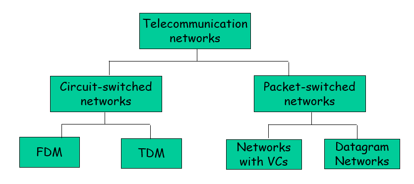

## Page 1-28 Access networks
---
### How to connect end systems to edge router?
1. Residential access nets (一般民用)
* Point to point access
>* Dialup via modem(數據機、電話線撥接) :
>> Slow , can't be always on;
>* ADSL (asymmetric digital subscriber line) :
>>* 上傳和下載速度不一樣
>>* Use FDM (frequency divide)
* Cable modems
>* HFC: hybrid fiber coaxial cable(銅軸電纜、光纖)
>* Asymmetric(上傳和下載速度不一樣)
>* network of cable and fiber attaches homes to ISP router
>>* shared access to router among home
>>* issues: congestion, dimensioning

2. Company access : Local area networks (LAN)
* Ethernet : 
>1. shared or dedicated(專用) link connects end system and router
>2. Deployment(部署) : institutions(機構), home(家), company (公司) 

3. Wireless access networks
* End systems connect to routers via base station
>* base station(基地台) also known as “access point”

4. Home networks (Typical home network components):
* Lv1. Router
* Lv2. ADSL or cable modem (public IP)
* Lv3. small router(private IP) , include : firewall , NAT
* Lv4. Ethernet
* Lv5. wireless access point(路由器)

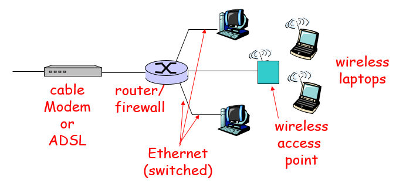

## Page 1-39 Physical Media
---
### Bit :
* 傳輸最基本單位
### Physical link :
1. Guided media(實體材料): Copper, Fiber, Coax
>1. Twisted Pair(TP) 雙絞線
>* 兩條絞在一起，抵銷電磁波干擾

>2. Coaxial cable(銅軸電纜)
>* bidirectional(雙向)
>* baseband (single channel) , broadband (multiple channels)

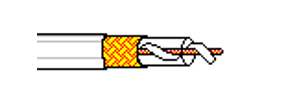

>3. Fiber optic cable:
>* glass fiber carrying light pulses, each pulse a bit
>* high-speed
>* low error rate(不被電磁波干擾)
>* repeater (訊號放大器，延長訊號傳遞)

2. Unguided media(非實體材料) : Radio
* signal carried in electromagnetic spectrum(電磁波)
* no physical “wire”
* bidirectional
* propagation environment effects:
>1. reflection (訊號反射)
>2. obstruction by objects (訊號被阻擋)
>3. interference (訊號干擾)
* Radio link types :
>1. Terrestrial  microwave (微波)
>* e.g. up to 45 Mbps channels
>2. LAN (Wifi .. )
>* 2Mbps, 11Mbps, 54Mbps, 108 Mbps
>3. Wide-area (cellular 蜂窩狀)
>* 手機4G , 5G : hundreds of kbps
>4. Satellite
>* up to 50Mbps channel (or multiple smaller channels)
>* 270 msec end-end delay(延遲長)
>* geosynchronous versus low-earth-orbit satellites (LEOS低軌衛星)

## Page 1-50 Packet Delay
---
### Processing delay
* check bit errors
* determine output link 
### Queueing delay
* waiting at buffer for transmission 
* depends on congestion
### Transmission delay 
* R = link bandwidth(bps)
* L = packet length (bits)
* time to send bits into link = L/R 
### Propagation delay 
* d = length of physical link 
* s = propagation speed in medium(~2*10^8 m/sec)
* propagation delay = d/s

### Nodal delay (節點延遲)
* d_nodal = d_proc + d_queue + d_trans + d_prop

### Traffic Intensity
* R = link bandwidth (bps)
* L = packet length (bits)
* a = average packet arrival rate
* L * a = average bit arrival rate 
* traffic intensity  I = ( L * a ) / R 
* I < 1 delay small
* I -> 1 delay become large
* I > 1 delay infinite , packet loss

## Page 1-60 Protocol Layers
---
### Encapsulation
* 往下層送的行為
### Layers
1. application
* supporting network applications : FTP, STMP, HTTP
2. transport
* host-host data transfer : TCP, UDP
3. network
* routing of datagrams from source to destination : IP, routing protocols
4. link
* data transfer between neighboring  network elements : PPP, Ethernet
5. physical 
* bits “on the wire”
### Header
* message (application Message) : content
* segment (transport header) : addressing reliability check info
* datagram (network header) : source & destination IP 
* frame (link header) : source & destination network-card address

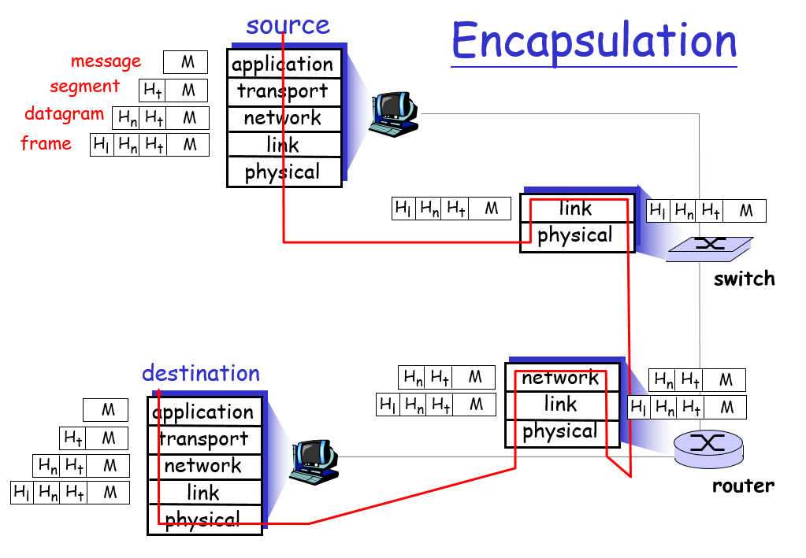

# Chapter 2 Application Layer
## Page 2-2 Client-server archicture
---
### server: 
* always-on host 
* permanent IP address 固定IP
* server farms for scaling 大規模要建置server farm
### clients:
* communicate with server
* may be intermittently connected 可暫時連結
* may have dynamic IP addresses 可動態IP
* do not communicate directly with each other  客戶之間要由server轉介

## Page 2-9 Pure P2P architecture
---
* no always on server 沒有server
* arbitrary end systems directly communicate 直接溝通
* peers are intermittently connected and change IP addresses 可動態IP、暫時連結
* example: Gnutella (P2P代表之一)
* 優 : Highly scalable 可以容易擴充規模
* 缺 : But difficult to manage 難以維護

## Page 2-10 Hybrid of client-server and P2P (混合式)
---
### Napster
* File transfer P2P (傳檔案不經過server)
* File search centralized: (server負責看誰有檔案、分配)
> * Peers register content at central server
> * Peers query same central server to locate content
### Instant messaging
* Chatting between two users is P2P (client P2P)
* Presence detection/location centralized: (server)
> * User registers its IP address with central server when it comes online
> * User contacts central server to find IP addresses of buddies

## Page 2-11 Processes communicating
---
### Same host
* two processes communicate using  inter-process communication (defined by OS).
### Dif host
* processes in different hosts communicate by exchanging messages
### Client process:
* process that initiates communication
### Server process:
* process that waits to be contacted
### P2P
* applications with P2P architectures have client processes & server processes

## Page 2-12 Processes communicating across network
---
### Socket
* process sends/receives messages to/from its socket
* API : choose transport protocol, then a few parameters (IP, port ...)
### Addressing processes
* For a process to receive messages, it must have an identifier
> 1. host has a unique 32-bit IP address
> 2. port (16-bit) numbers associated with the process on the host
* IP代表host的位置 、 port 代表host全部的process中的哪一個
### App-layer protocol defines
* Types of messages : req or res 
* Syntax of message : 格式，哪個位置代表什麼訊息
* Rules for when and how processes send & respond : 回應的規則
#### Public-domain protocols:
* defined in RFCs (定義標準組織)
* allows for interoperability(互通性、相容性)
eg, HTTP, SMTP (標準)
#### Proprietary protocols:
eg, KaZaA (非標準)

## Page 2-15 What transport service does an app need
---
### Data loss
* some apps (e.g., audio) can tolerate some loss
* other apps (e.g., file transfer, telnet) require 100% reliable data transfer 
### Timing
* 延遲
### Bandwidth
* multimedia may require minimum amount of bandwidth to be “effective”

## Page 2-17 Internet transport protocols services
### TCP 
* connection-oriented: 使用前要先建連線
* reliable transport : 可靠、不能掉封包
* flow control: sender won’t overwhelm receiver 
* congestion control: 擁擠控制，掉封包就放慢
* 不保證傳送的時間、速度、頻寬
### UDP
* 不可靠的資料傳送
* 沒有提供 : 建連線、流量控制、擁擠控制、傳送時間、速度、頻寬

## Page 2-20 Web and HTTP
### Web Page
* base HTML-file 
* many objects
* URL (Uniform Resource Locators) 
### HTTP : hypertext transfer protocol
* Web’s application layer protocol
* client/server model
* used TCP :
> 1. client initiates TCP connection (creates socket) to server, port 80
> 2. server accepts TCP connection from client
> 3. send messages
* stateless : 不會記之前的req
* RTT : 小型回應持間

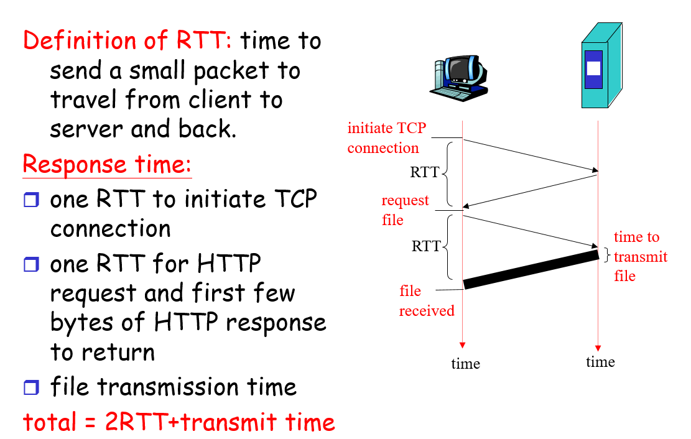

* Nonpersistent HTTP
> * At most one object is sent over a TCP connection.
> * 一個TCP連線只能傳送一個object，送完就關閉連線
> * without parallel connection Non-persistent :
> 1. Each objection takes two RTT (assuming no window limit) one for TCP connection and other for HTTP image/text file.
> * with parallel connection Non-persistent :
> 2. 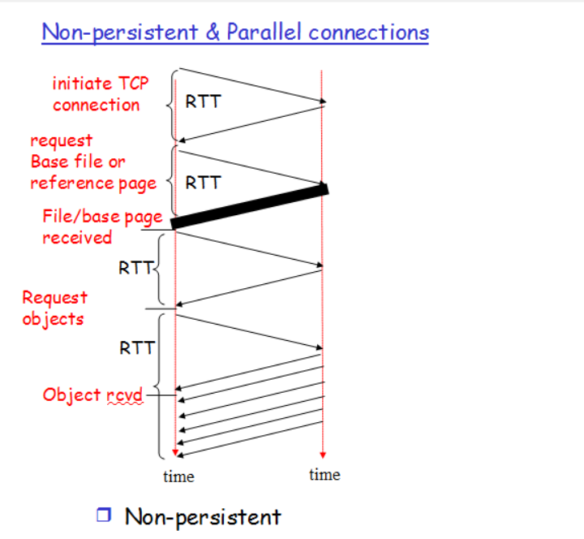 

* Persistent HTTP
> * 一個TCP 連線可以傳送多個objects 
> 1. without pipelining : one RTT for each object
> 2. with pipelining : 幾乎只要one RTT
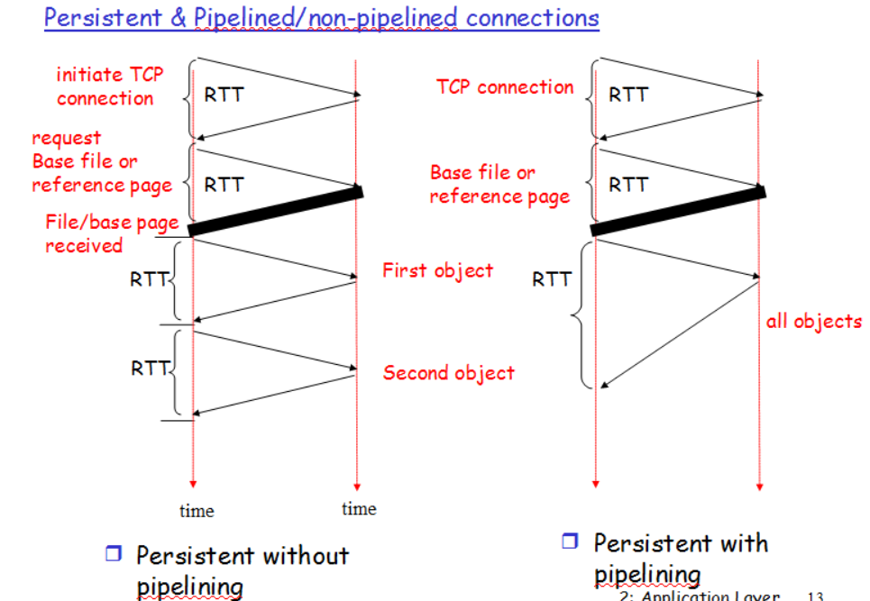 

* HTTP request message

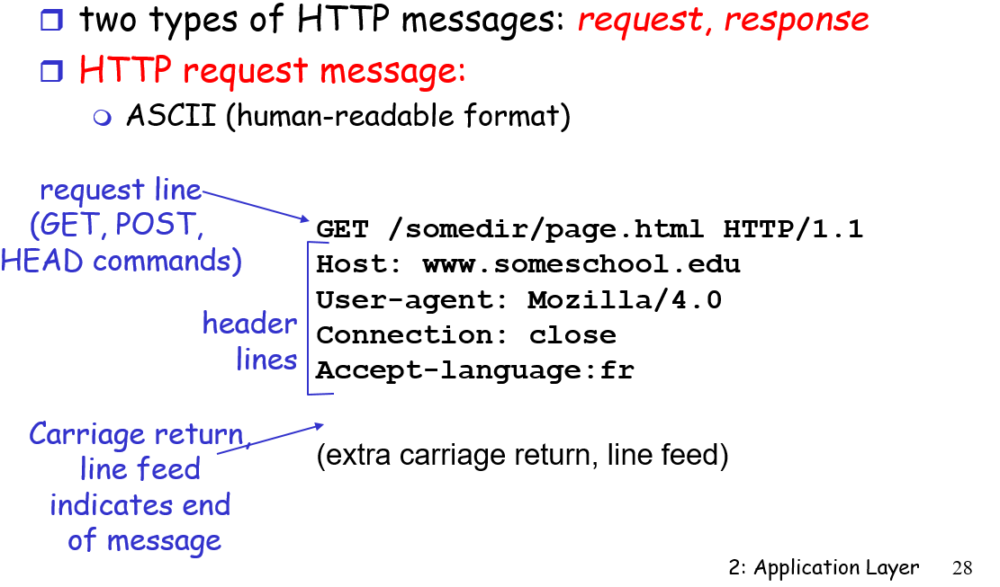 
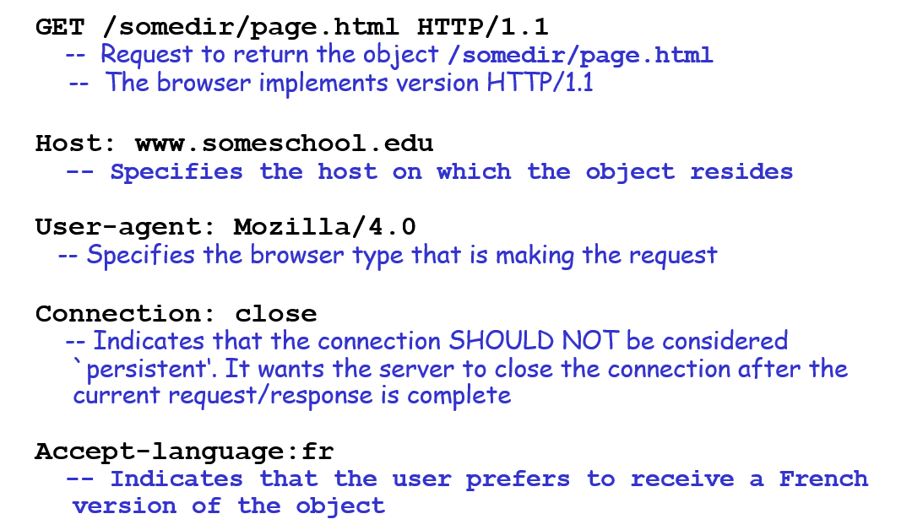 
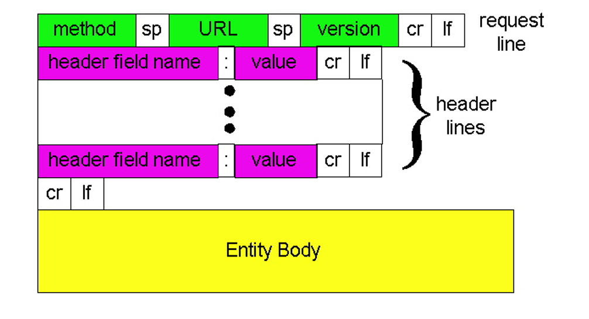 

* HTTP response message

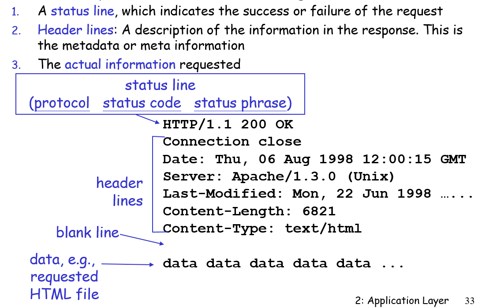 
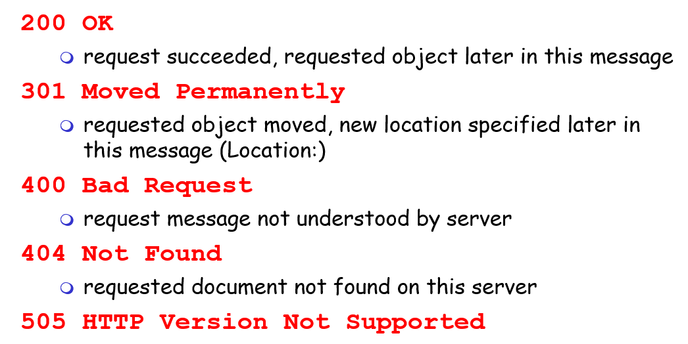 

## Page 2-37 User-server state: cookies
* Four components of cookie technology:
1. cookie header line in the HTTP response message
2. cookie header line in HTTP request message
3. cookie file kept on user’s browser
4. back-end database at Web site
* What cookies can bring:
1. authorization
2. shopping carts
3. recommendations
4. user session state (Web e-mail)

## Page 2-40 Web caches (proxy server)
---
* Proxy server : 暫存伺服器
> * client 連到proxy server再由proxy server 決定要不要連到主伺服器
* 好處: 
> 1. reduce response time 縮短回應時間
> 2. reduce traffic 減少流量、分散流量

#### Cach example

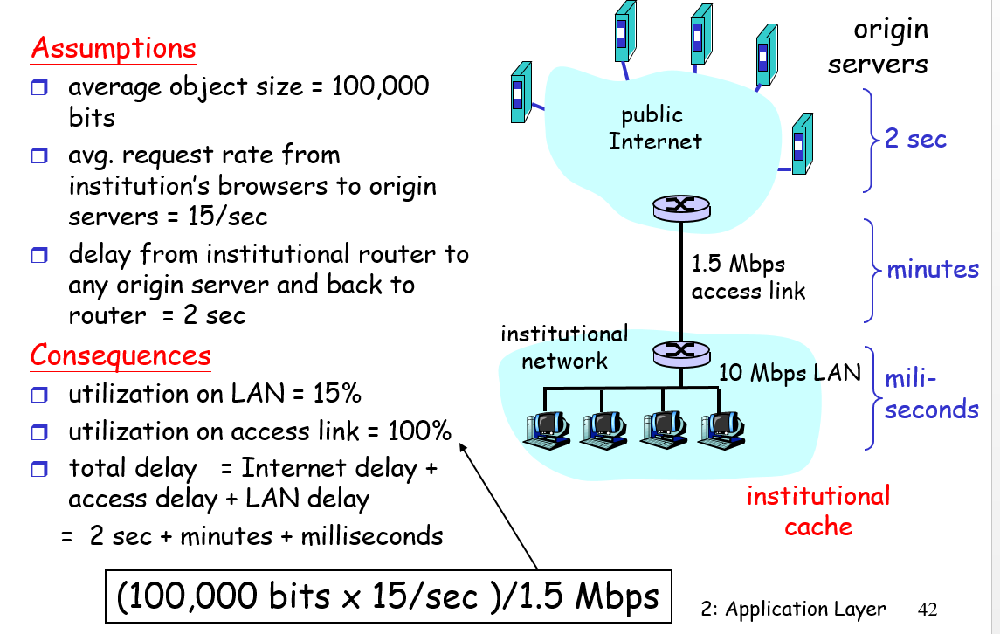 
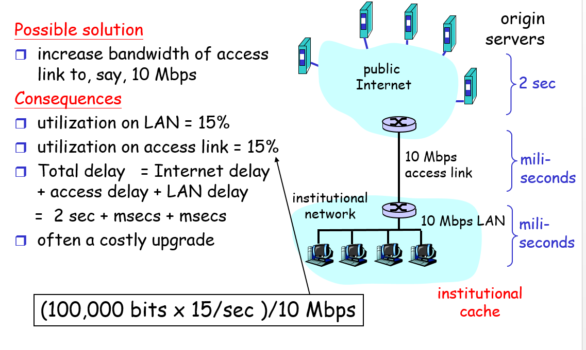 
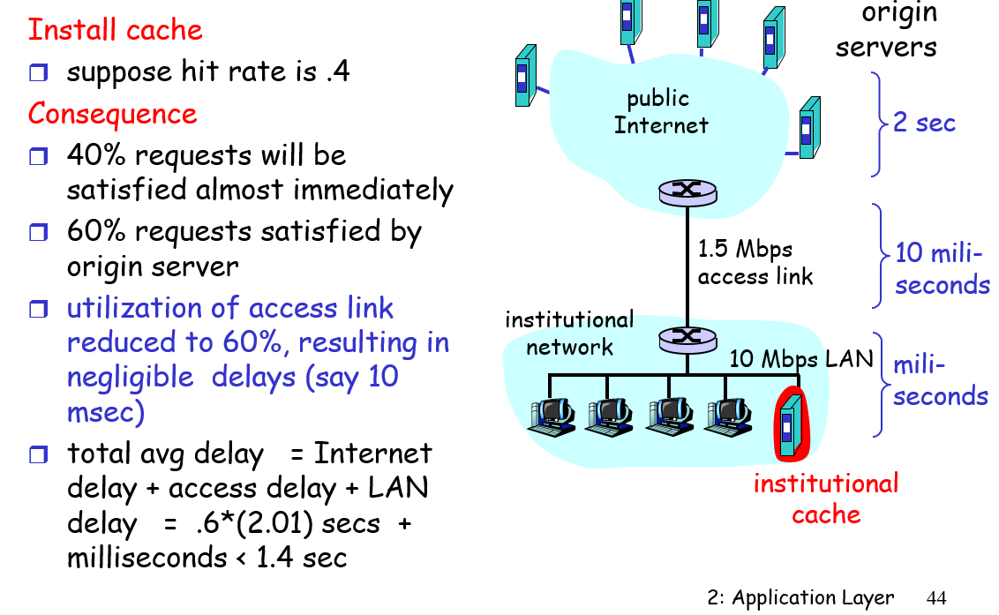 

## Page 2-47 FTP : the file transfer protocol
---
* FTP client contacts FTP server at port 21， 以TCP為底
* Will maintains “state”: current directory, earlier authentication
* Total 2 connection :
> * control connection (port21) (also called “out of band”)
> 1. 傳送 : username, password, file transfer command
> * data connection (port20) 
> 1. server open a TCP data connection when receive file transfer command
> 2. 傳送檔案

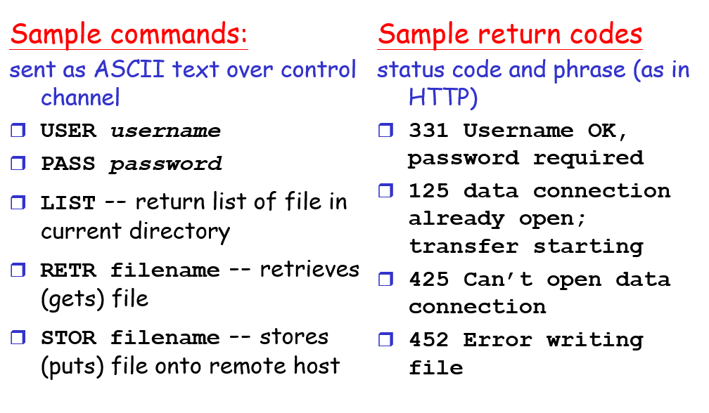 

## Page 2-51 Electronic Mail
---
### User Agent
* read mail
### Mail Servers 
* mailbox contains incoming messages for user
* message queue of outgoing mail messages
### SMTP 
* Simple Mail Transfer Protocol (port25)
* delivery/storage to receiver’s server
* use TCP 
* three phases:
1. hand shaking
2. transfer messages
3. close
* command/response interaction
1. commands: ASCII text
2. response: status code and phrase

### Mail access protocol
* retrieval from server
1. POP3: Post Office Protocol, version 3 [RFC 1939]
> * authorization (agent <--> server) and download 
> * 將mail存到自己的電腦裡做處理
> 1. Client opens a TCP connection to the mail server on port 110
> 2. authorization phase : 輸入帳密
> 3. transaction phase : 輸入指令
> 4. update phase : 更新(刪除剛剛選的信)
2. IMAP: Internet Mail Access Protocol [RFC 2060]
> * mail在receiver server裡面處理
3. HTTP: Hotmail , Yahoo! Mail, etc.

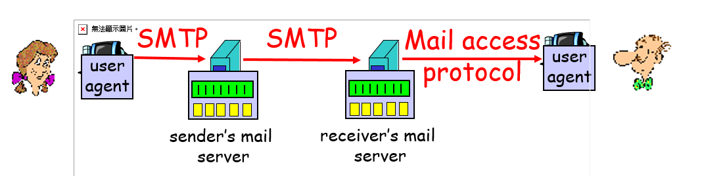 

## Page 2-67 DNS: Domain Name System
---
* A distributed database 
* An application-layer protocol 
* Hostname to IP address translation
* Host aliasing :
>1. Canonical : Relay1.west-coast.enterprise.com
>2. alias names : www,enterprise,com
* Distributed, Hierarchical Database
>1. root name servers
>2. top level name servers ( .com .org .net .edu .jp .uk)
>3. authoritative name servers:
>4. local name servers: (大公司、學校)

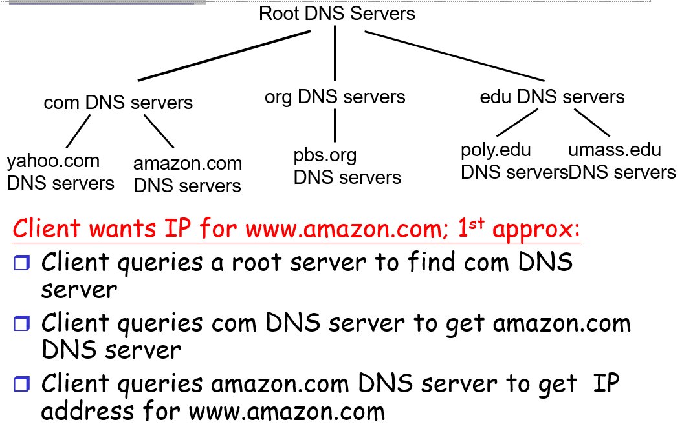 

### Recursive queries
* recursive query
> 查一個，沒有就叫他幫忙查
* iterated query
> 查一個，沒有就自己找下一個

## Page 2-88 P2P file sharing
---
* All peers are servers = highly scalable!
* Query flooding: 廣播看誰有檔案
>* overlay network: graph
>* edge between peer X and Y have a TCP connection
>* Peer joining
>1. find some other peer in network: use list of candidate peers
>2. attempts to make TCP with peers on list until connection setup
* Exploiting heterogeneity: KaZaA (一種P2P)
>* use hash to avoid same file content

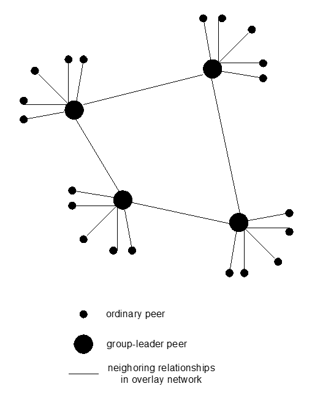 

## Page 2-98 Socket
---
* socket :
> a host-local, application-created, OS-controlled interface (a “door”) into which  
> application process can both send and receive messages to/from another application process
* use TCP (bytes stream)
> * Client must contact server : server process must first be running
> * Client contacts server by IP address, port number of server process
> * When contacted by client : server TCP creates new socket 
* use UDP (packets)
>* no “connection” between client and server
>* no handshaking
>* sender put IP address and port in each packet
>* server must extract IP address, port of sender from received packet
>* data may be received out of order, or lost

# Chapter 3 Transport Layer
---
## Multiplexing/demultiplexing
* Multiplexing 選擇往下送的socket
* Demultiplexing 選擇往上送的socket(根據port)
* Both network layer need IP address
### UDP 
* UDP socket : 需要source port & destination port , 可共用
* UDP check sum to detect error
* how to recover from errors:
> * acknowledgements (ACKs): receiver  tells sender that packet is OK
> * negative acknowledgements (NAKs): receiver tells sender that packet is errors

### Principles of  Reliable data transfer
1. seq num (封包座號) 2. ACK(已接收成功) 3. check sum(封包完整) 4. timeout(超時) 
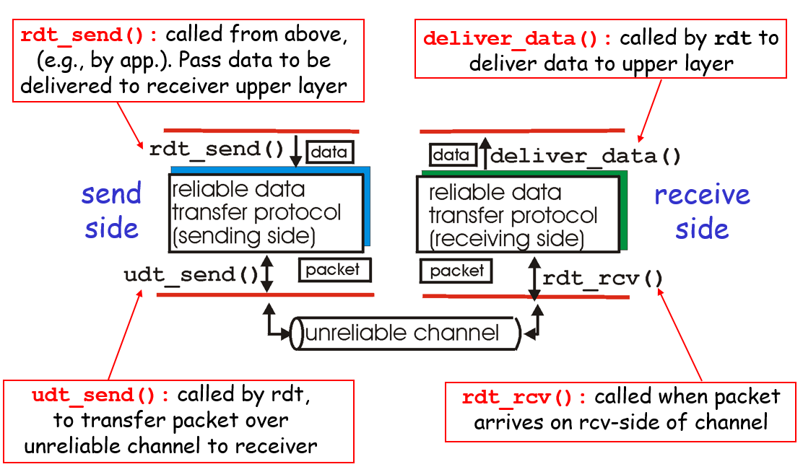 
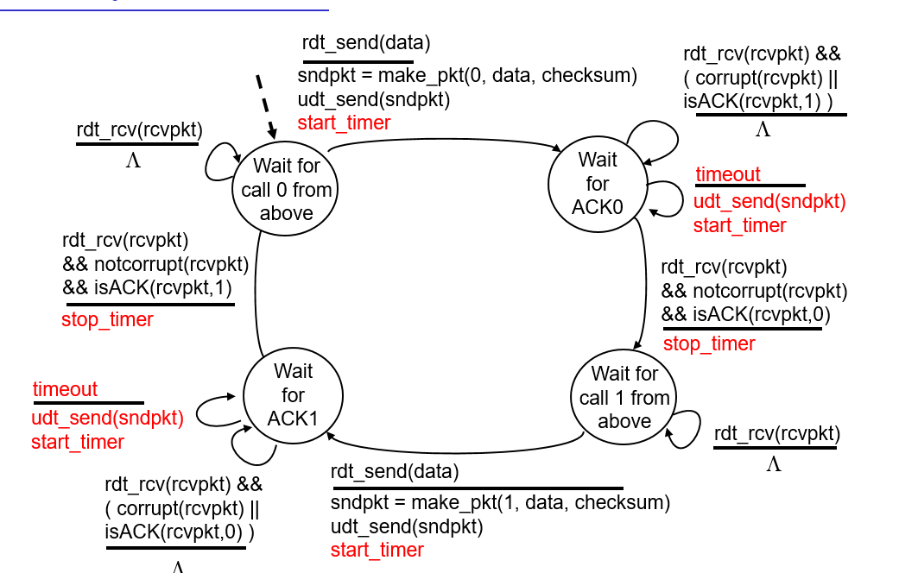 
#### no pipeline RDT
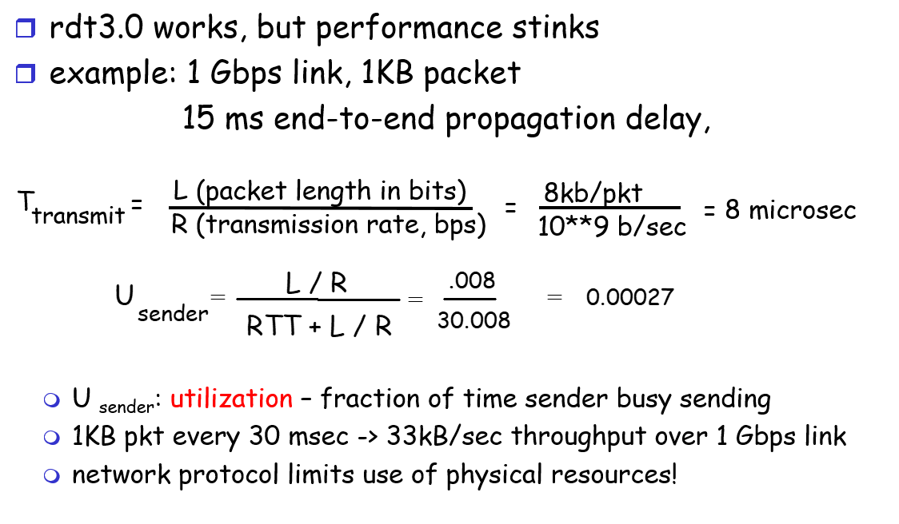 
####  pipeline RDT
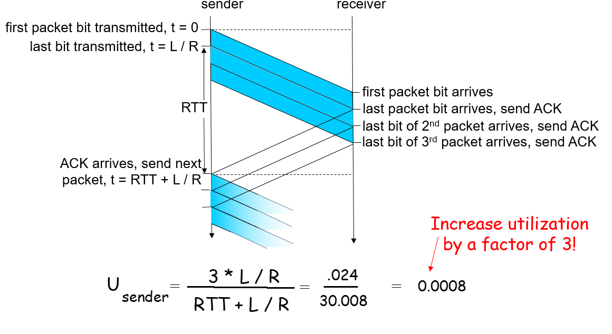 
#### Go-Back-N (pipeline)
* ACK(n) : 小於等於n的封包都已經收到
* 一個timer : timeout 就重傳，n+1 ~ n+N
#### Selective repeat (pipeline)
* ACK(n) : 收到編號等於n的封包
* 多個timer : timeout(n) 就重傳，n

### TCP
* TCP socket: 需要source port,IP & destination port,IP ,不可共用
1. point-to-point:
2. reliable, in-order byte stream:
3. pipelined:
* TCP congestion and flow control set window size 
4. send & receive buffers
5. Cumulative acks
6. full duplex data:
* 雙向的傳送 
* MSS: maximum segment size 
7. connection-oriented: 
* handshaking  
8. flow controlled:
* sender will not overwhelm receiver 
#### segment 

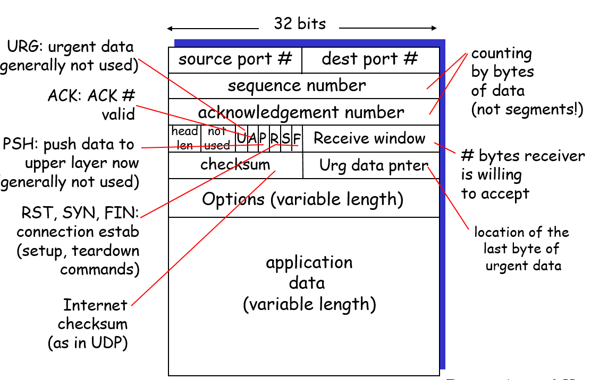 

#### trans

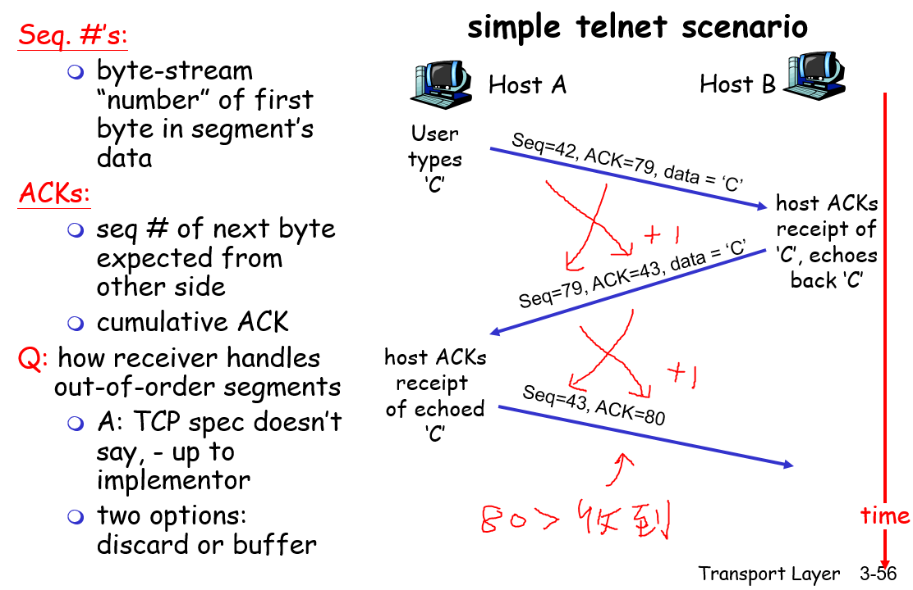 

#### timeout : SampleRTT 經常去測量RTT

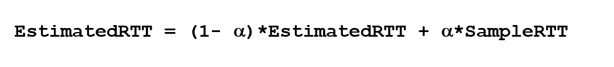 

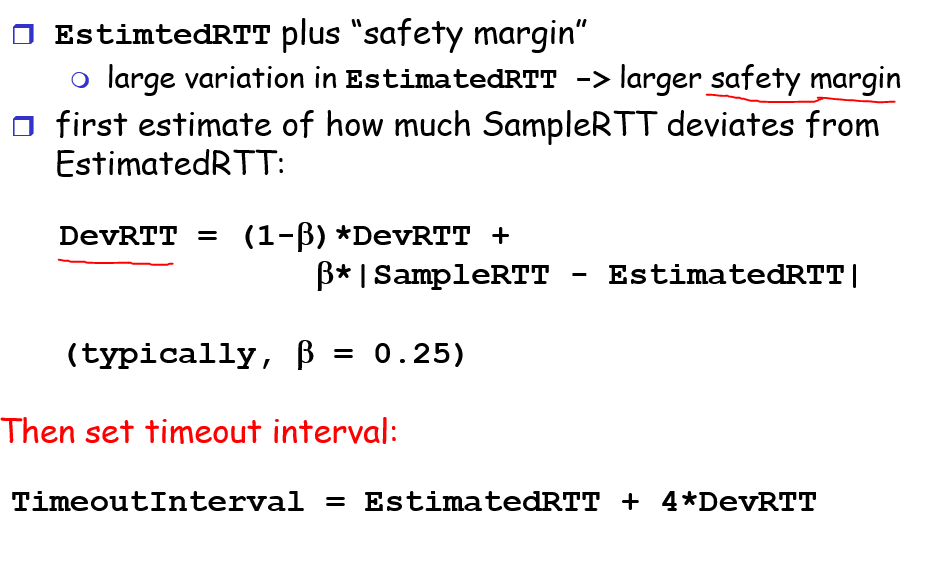 

#### TCP reliable data transfer
* one timer
* pipeline segment
* Cumulative acks

#### Fast  Retransmit
* Detect duplicate ACKs three times (沒有進展就重送)
* faster than timeout 

#### Flow control 
* reciever advertises spare room by including value of RcvWindow in segments

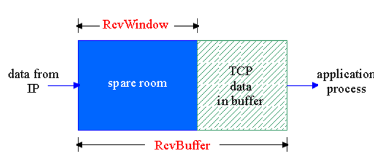 

#### TCP Connection Management 

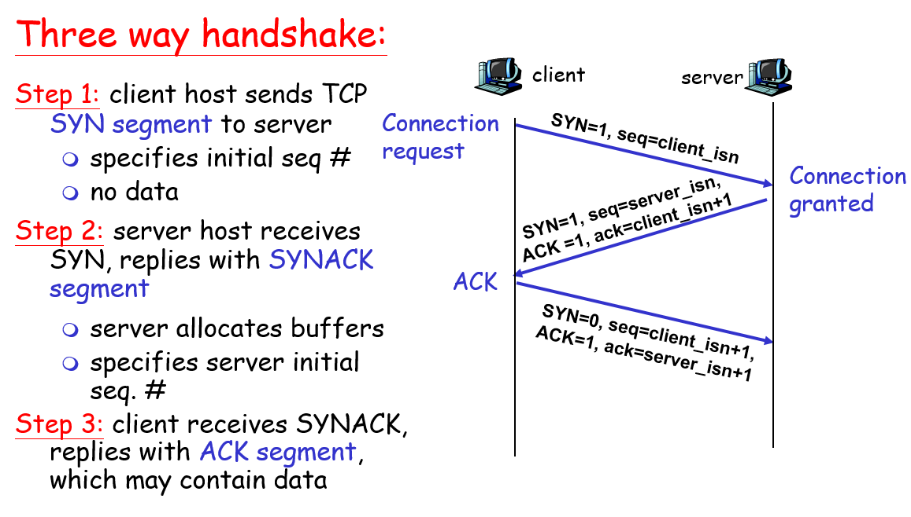 

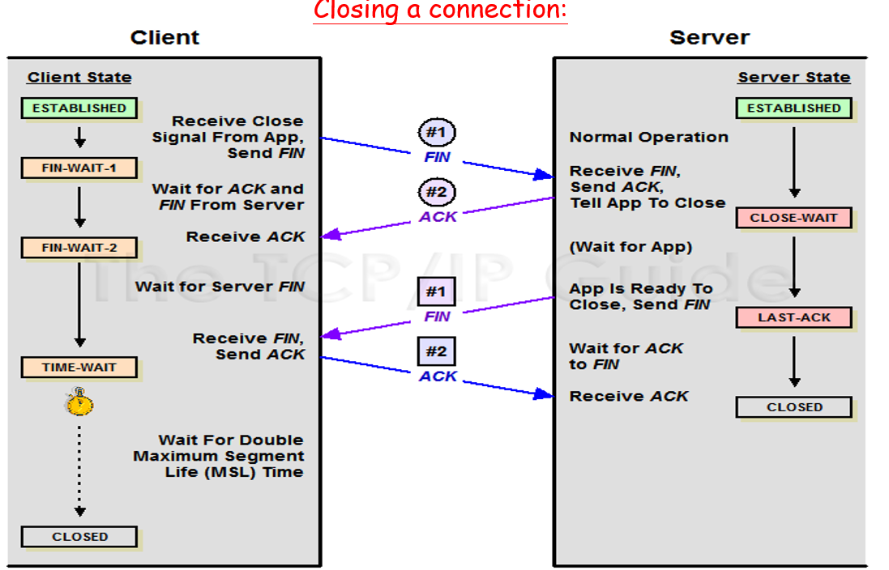 

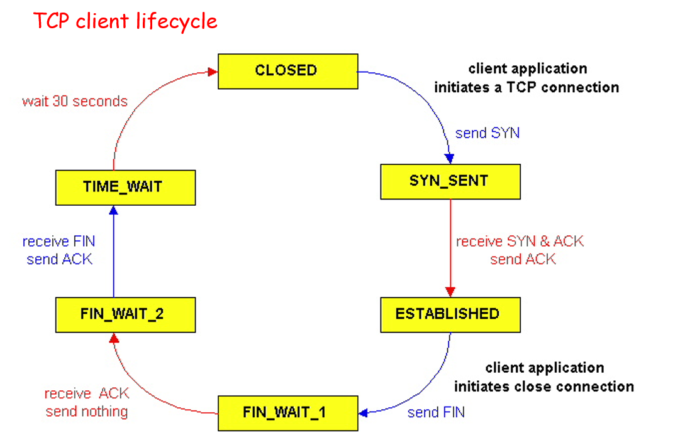 

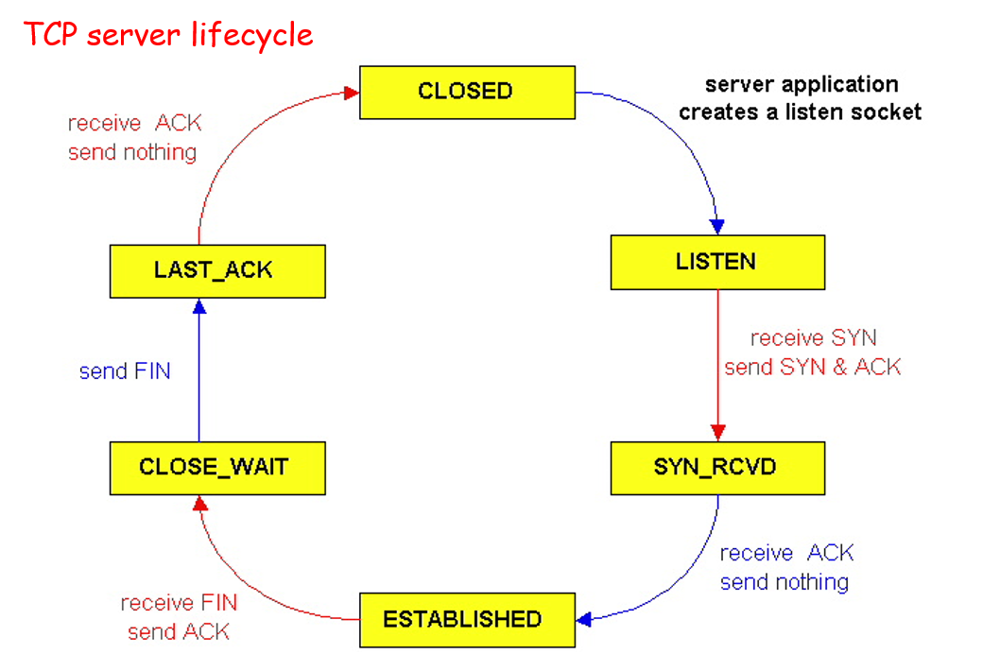 

* syn robbing : 送出很多syn傳送需求，server allocate 很多buffer，但是都是假的

### Principles of Congestion Control
---

* too many sources, data, too fast for network to handle
* End-end congestion control : TCP自己判斷
1. delay , loss 很多
* Network-assisted congestion control (Router判斷)
1. router回饋給end system，告知傳送速度應該多少
#### ATM ABR congestion control(非同步模式網路)
* ABR: available bit rate , elastic service
* RM (resource management) cells: 根據傳送的cell看是否擁擠
> * NI bit: 不擁擠
> * CI bit: 擁擠了
### TCP Congestion Control
---
* 1 maximum segment size (MSS) 
* CongWin

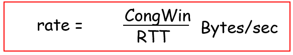 

* is congestion:
1. loss event = timeout or 3 duplicate acks
2. TCP sender reduces rate (CongWin) after loss event
* solution :
1. AIMD : 
> * Additive-increase : CongWin每個RTT增加一個MSS
> * multiplicative-decrease : loss CongWin就減一半

2. slow start : CongWin收到一個ACK增加一個MSS
3. Reaction to loss events :
> * timeout : CongWin set to 1 MSS;
> * 3 dup ACK : CongWin cut half;
> * theshold = loss CongWin/2
>> * congestion-avoidance phase : grows linearly when arrive threshold

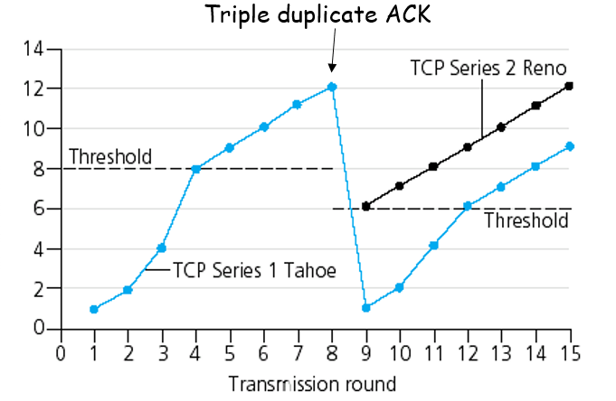 

* Average throughput

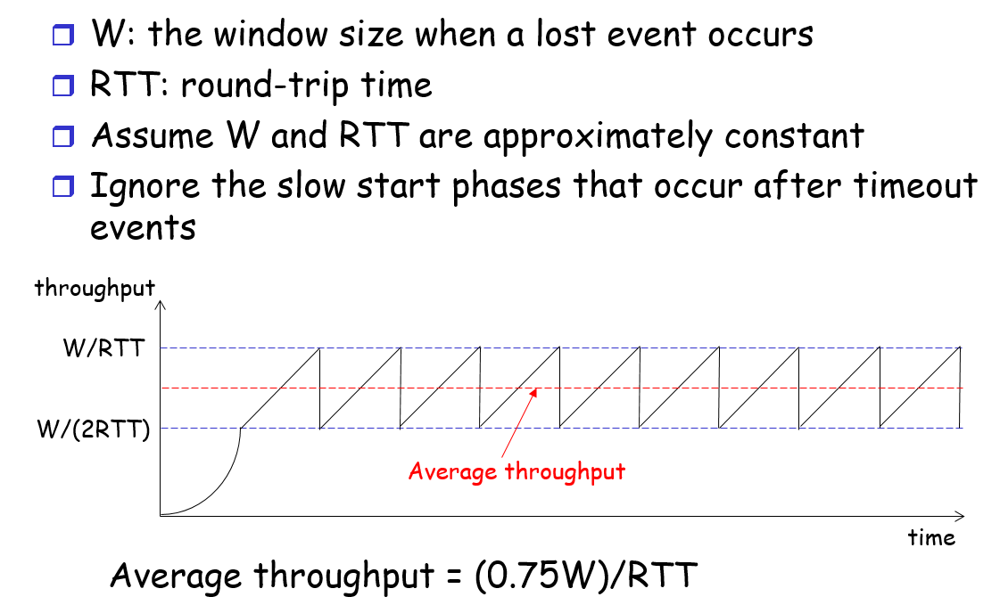 

# Chapter 4 Network Layer
---
## forwarding: 
* 選擇下一個router
* 根據table(隨時會變)
## routing
* 找出起點到終點的路徑(最短路徑，隨時會變)
## Connection setup

## Network and transport layer connection service:
* Network: between two hosts (IP)
* Transport: between two processes (IP, PORT)

## connection and connection-less service
* Datagram network : connectionless service
* VC network : connection service
* Service: host-to-host (network layer)
* No choice: 只能選用一種
* in the core (在router)

## Virtual circuits
* 要先建connection
* 每個packet都有VC ID，每經過router都會改變  (沒有IP因為路線已經建好了)
* 保證一定速度、頻寬、loss、delay
* 每個router都有forwarding table來maintain connection
* 存每個connection可使用的資源
* VC teardown 結束

## Datagram networks (Internet)
* no call setup
* 每個封包都有紀錄起點&終點IP
* 有多少頻寬就用多少，不保證速度、loss、delay
* packets forwarded using destination host address

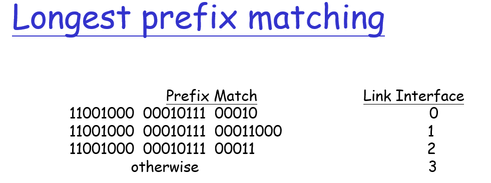 

## Router Architecture
* 建table : routing algorithms/protocol (RIP, OSPF, BGP)
* forwarding datagrams from incoming to outgoing link
* switching farbic : 將查表後的封包轉到對應port的機器
* goal: complete input output at ‘line speed’ (進來速度和出去一樣)

### Input port
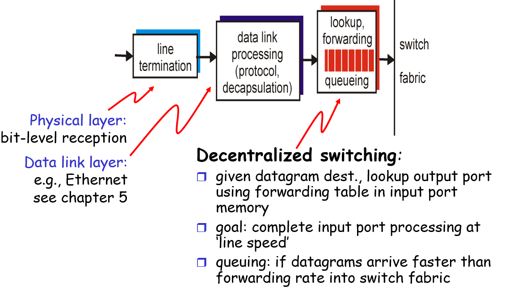 

#### Head-of-the-Line (HOL) blocking
* input port queue 的第一個packet搶不到對應output port的位置，導致那個input port卡住

#### Three types of switching fabrics
1. via memory (packet寫入memory，再由目的端讀取)
> * slow (need two memory access , cpoy packet) 
2. via bus (input port廣播packet給每個output port，由output port決定要不要收)
> * switching speed limited by bus bandwidth  
3. via crossbar (棋盤式路線)
> * 同時給同一個port還是會卡住

### Output port

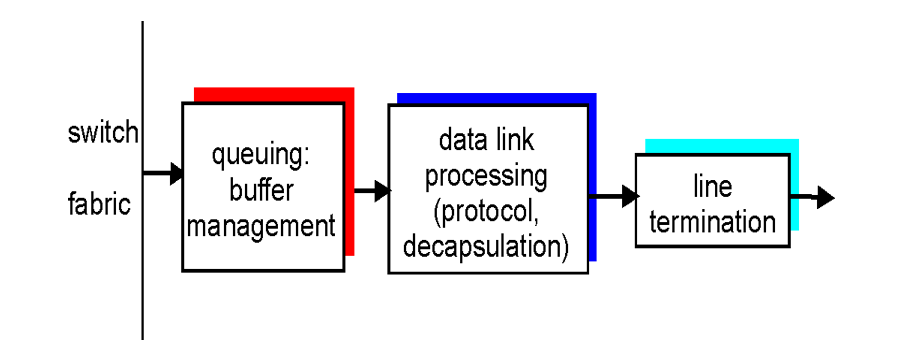 

* Buffering : 存太快進來的就先存近來 (可能會loss)
* Scheduling discipline : schedule algorithm決定優先順序

## IP: Internet Protocol

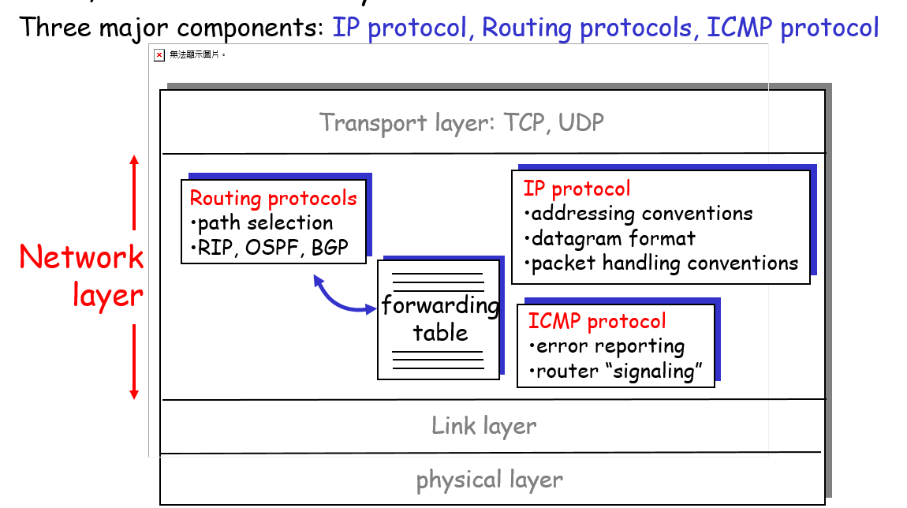 

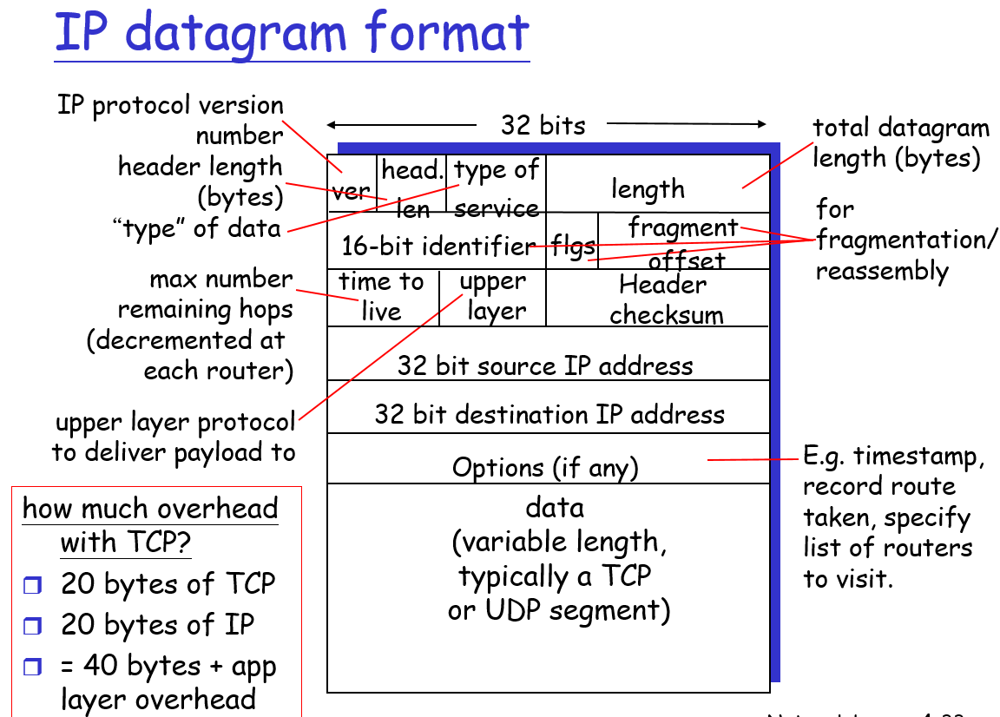 

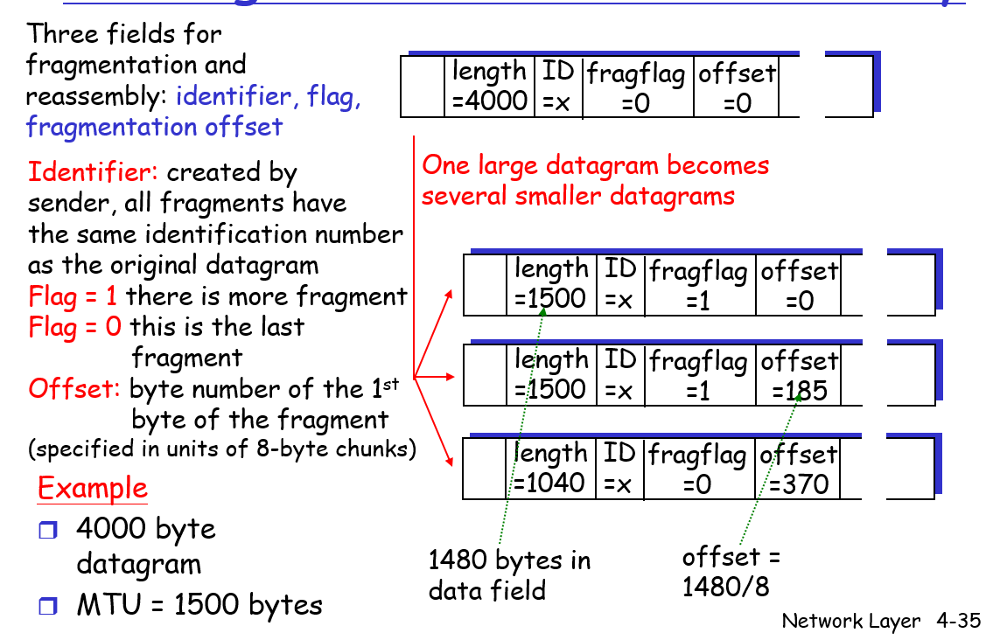 

* IP address: 32-bit identifier for host, router interface
> * CIDR: Classless InterDomain Routing : a.b.c.d/x -> x = subnet bits
> * subnet part (high order bits)
>> * same subnet connect don't need router

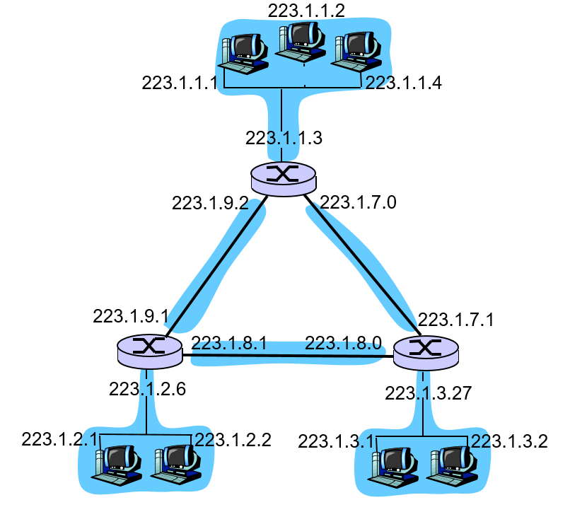 

> * host part (low order bits) 
 
* router have mutiple IP ( 網路卡數量)
* host usually have one IP
* DHCP: Dynamic Host Configuration Protocol: 動態IP
* ICANN: Internet Corporation for Assigned Names and Numbers : 授權IP的組織

#### NAT: Network Address Translation
* 對外共用同一個IP，內部IP用New port分辨(16bits, 60000)
> * 出去的datagrams: (source IP address, port #) 改為 (NAT IP address, new port #)
> * 紀錄 NAT translation table
> * 進來的datagram用table轉為local IP
* NAT 內的無法被動接收 -> 固定New port

#### ICMP: Internet Control Message Protocol
* error reporting, echo request/reply (used by ping
* network-layer “above” IP: ICMP messages carried in IP datagrams
* Traceroute : sends many of UDP segments to dest
> * First has TTL =1 (過一個router減一)
> * Second has TTL=2, etc.
> * 送假的 port number : 最後回傳“port unreachable” packet (type 3, code 3)

#### IPv6
* 原因IPv4 : 32-bit address 快被用完了
* IPv6: 128-bits IP address
* header format change : 40 btyes header
* no fragmentation allowed (ICMPv6: new error types “Packet Too Big”)
* Checksum: removed 
* Options: allowed, but outside of header, indicated by “Next Header” field

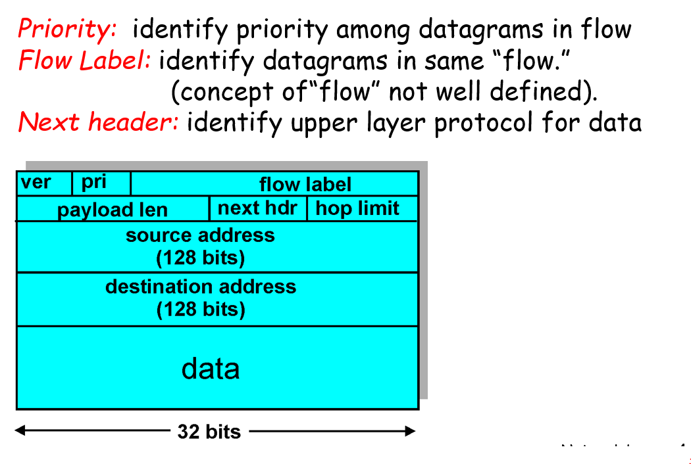 

* Transition From IPv4 To IPv6 :
> * Tunneling

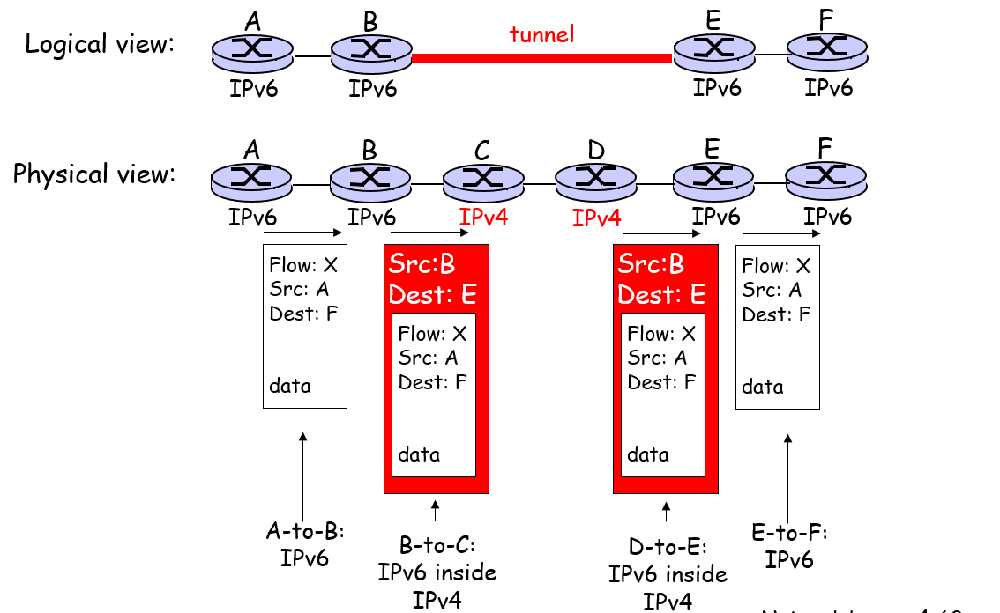 

## Routing algorithms
* Static: routes change slowly over time
* Dynamic: periodic update, change when link cost changes

### Global: 每個router都有完整的網路結構
* “link state” algorithms
* Dijkstra’s algorithm : O(n2)
1. c(x,y): link cost 
2. D(v): 目前到V得最少cost
3. p(v): 到v的前一個node
4. N': 已經走過的node集合
5. 有可能震盪

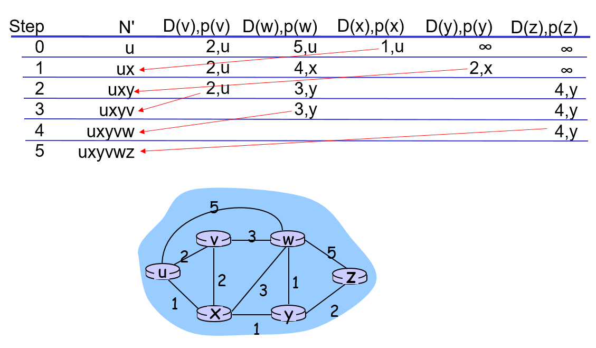 

###  Decentralized : 只知道鄰居有誰、速度如何
* “distance vector” algorithms
* Bellman-Ford :
1. dx(y) = min {c(x,v) + dv(y) }
2. c(x,y): link cost 
3. self distance vectors Dx(y) = 目前到y得最少cost
4. maintain neighbors’ distance vectors (router交換)
5. if self DV changes : notify neighbors
6. cost變小收斂快、變大收斂慢

### Hierarchical Routing (階層式)
* "autonomous systems” (AS) : 自治區
* 同一個AS自行決定routing protocal(algorithm)
* “intra-AS” routing -> same AS
* “inter-AS” routing -> outer AS , intra connect with gateway
* Hot potato routing : min cost gateway

## Routing in the Internet
### Intra-AS Routing : Interior Gateway Protocols (IGP)
1. RIP: Routing Information Protocol
> * <b>application-level </b> ，經UDP
> * Distance vector algorithm
> * edge cost = 1  -> hops (走幾步)
> * 每30sec交換一次(also called "advertisement")，經UDP
> * 108sec沒有回應視為router死掉，所有經過的路徑設為invalidated

2. OSPF: Open Shortest Path First
> * Link State algorithm 
> * "advertisement"，經IP
> * Security : 交換要認證
> * Multiple same-cost paths allowed (維護多個短路徑)
> * TOS : 不同用途link cost不一樣
> * Hierarchical OSPF in large domains. (backbone , area)

### Internet inter-AS routing : BGP (Border Gateway Protocol)
* 讓subnet在Internet廣播: “I am here”
* pair of routers exchange with TCP connections : BGP sessions
* eBGP session : inter-AS之間傳 prefix reachability information 
* iBGP session : intra-AS之間廣播 advertisement
* advertisement  = prefix + attributes (AS-PATH, NEXT-HOP)
* gateway uses import policy to accept/decline advertisement.

#### BGP messages
1. OPEN: opens TCP connection to peer and authenticates sender
2. UPDATE: advertises new path (or withdraws old)
3. KEEPALIVE keeps connection alive
4. NOTIFICATION: reports errors or close connection

### different Intra- and Inter-AS routing 
* Intra-AS: can focus on performance
* Inter-AS: policy may dominate over performance(control traffic)

## Broadcast and multicast routing 

### Broadcast routing algorithms
* Uncontrolled flooding : may have cycle
* Controlled flooding : 
> 1. stop when broadcast ID have been send
> 2. drop when receive packet not from shortest path
* Spanning-tree broadcast : build tree first then send -> no cycle

### Multicast Routing

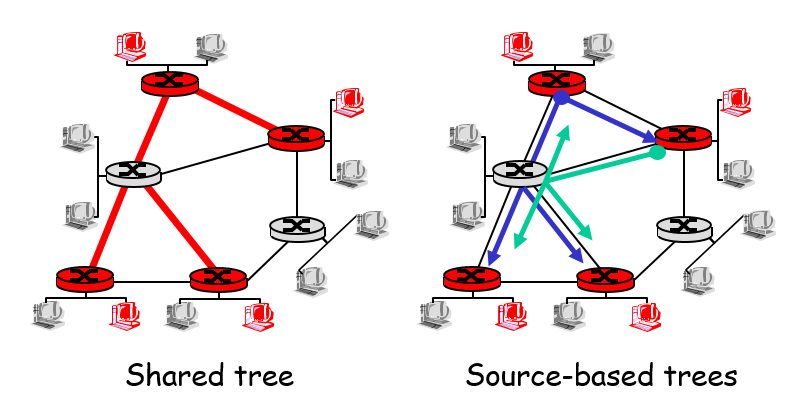 

* source-based tree: one tree per source
> * shortest path trees , reverse path forwarding
* group-shared tree: group uses one tree
> * minimal spanning (Steiner) : NPC-problem
> * center-based trees 

#### DVMRP: distance vector multicast routing protocol
* flood and prune(刪除不必要旁枝)
* soft state : 定時傳送已經prune
* Tunneling : some router only support unicast (包裝)
* following IGMP join at leaf

#### PIM: Protocol Independent Multicast
* Dense : 假設大家都是(flood, RPF)，少部分在prune
* Sparse:假設大家都不是(center base)，少部分在join

